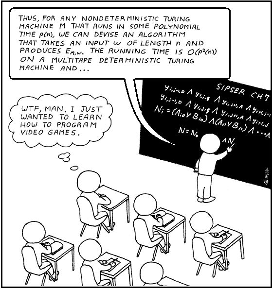

# Compilers

<p align="center">
    
</p>

```quote
The art of telling another human being what one wants the computer to do.  Donald Knuth
```


Let's start with this awesome introduction of what a compiler is https://www.destroyallsoftware.com/screencasts/catalog/a-compiler-from-scratch.   This is not from the traditional perspective of a compiler as a translation machine based on a particular type of lexical analyzer.


[https://spectrum.ieee.org/view-from-the-valley/computing/hardware/david-patterson-says-its-time-for-new-computer-architectures-and-software-languages](Why do we need new languages ?)


# Compiler Components

## Semantic Analysis

## Table of Symbols

## Runtime Environment

## Memory Management

## Abstract Syntax Tree

## Intermediate Language: IL, Abstract Stack Machine, Three Address Codes

## Target Language: Assembler, Object

## Linking

# What kind of new languages can be created ?

## Processing 

Languages to create programatically GUIs.

## Minifications

Minification is a key component of modern Web Dev.  A language could have minification (and obfuscation) in its foundations.


## Short languages
Many international programming competitions like IEEE eXtreme asks developers to produce good code, very fast.  To do that, we need languages that reduce the verbosity and allows very flexible boilerplate to produce code as quick as possible, mixing interactive and traditional mode.

## Design Patter Language

Instead of having a language, and create desing patterns on it, let's create a language that incorporates all the available design patterns into their core.

## Metaprogramming

There should be possible to create a generic language to create other languages (YACC?).

## Python

Why is python so successful ??

https://towardsdatascience.com/why-python-is-not-the-programming-language-of-the-future-30ddc5339b66

TL;DR: Dynamic type and block linking.

## RUST

Rust a growing language that has the goal to replace C.

https://hackaday.com/2015/12/18/programming-with-rust/
https://stackoverflow.blog/2020/06/05/why-the-developers-who-use-rust-love-it-so-much/

## DSL

These are Domain Specific Languages, which are not General Purpose Languages (C, Java, etc).

https://dl.acm.org/doi/10.1145/2692916.2557966
https://dl.acm.org/doi/10.1007/s10664-011-9172-x

## Scala, Bytecode and JVM

https://www.toptal.com/scala/scalabytecode-and-the-jvm


## Interpreter Creation

Interpreters are compiler with big runtimes.

https://ruslanspivak.com/lsbasi-part

## Graal and Truffle

Graal and Truffle is a very interesting project aimed to understand languages, and compilers, from a totally different perspective

 https://blog.plan99.net/graaltruffle-134d8f28fb69#.wwjmzbg2o

## Racket
Racket is a hyperlanguage that can be tailored to generate many other languages.  It generalize many language features that are very good to serve as inspiration.  Additionally, Racket authors provide a very wide set of tools for compiler creation.

https://www.racket-lang.org/


# Must See

* LLVM Tutorial:  https://llvm.org/docs/tutorial/LangImpl03.html
* LL and LR explained: o http://blog.reverberate.org/2013/07/ll-and-lrparsing-demystified.html
* Programming Languages Blog: http://lambda-the-ultimate.org
* Yacc is dead: https://arxiv.org/abs/1010.5023


# Books

* Lex and Yacc, Levine, 20xx
* Programming Languages Pragmatic, Scott, 2009
* Model Compiler Design, Grune, 2012
* Practical Foundations for Programming Languages, Herper, 2013
* Programming Languages Application and Interpretation, Krishnamurthi, 2012
* Hacker's Delight, Warren, 2003
